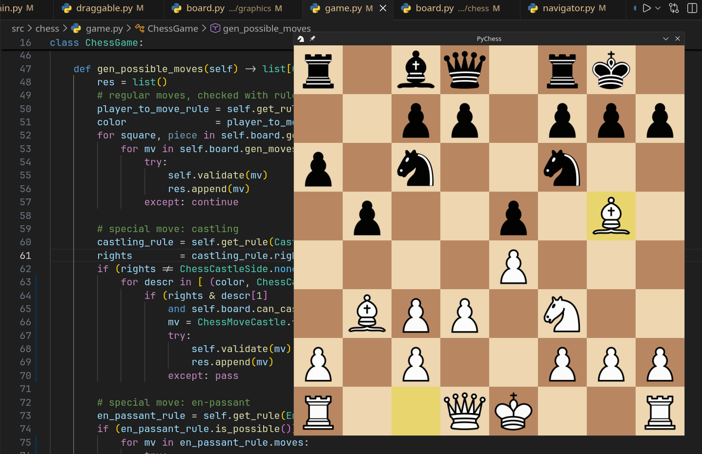

# PyChess - Chess implemented in Python

exercise-project where i tried to implement chess in python.
turns out it is quite difficult if you're dumb like me.

at the moment you can play regular chess with castling, en-passant and check 
(without promotions though bc that requires ui to select the thing).

the code is a bit messy and there is no way to reset the board
after checkmate.

# How to Play

if you have `pygame` and `pygame_gui` installed in your environment, run `python src/main.py`
and you should see a chess-board pop up.

# Credits

chess-piece-assets from https://greenchess.net/info.php?item=downloads